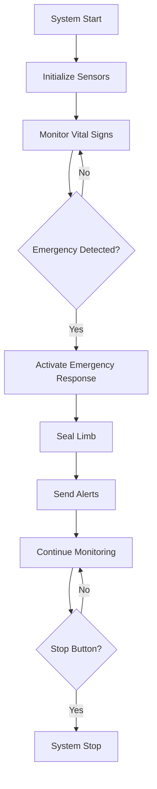

# Quick Seal Saviour: Automated Limb Bleeding Detection and Sealing System

[](LICENSE)
[](https://github.com/Nikhilkaswan007/Quick-Seal-Saviour)

## 🩺 Overview

The **Quick Seal Saviour** is an innovative IoT-based automated system designed for detecting and managing severe bleeding emergencies. This patent-pending technology (Application No. 202411102275 A) integrates multiple sensors and automated response mechanisms to provide rapid bleeding control and vital sign monitoring.

## ⚡ Key Features

- **Automated Bleeding Detection**: Resistive moisture sensors for blood detection
- **Impact Localization**: Piezoelectric sensors to identify injury location
- **Vital Sign Monitoring**: MAX30105 module for heart rate, blood oxygen, and temperature
- **Automated Limb Sealing**: Blood pressure cuff with DC motor and solenoid valve control
- **Emergency Alerts**: GPS-enabled emergency notifications
- **Real-time Display**: OLED display for vital statistics
- **Manual Override**: User control buttons for system management
- **Portable Design**: Compact and suitable for ambulances, hospitals, and field settings

## 🛠️ Hardware Components

| Component | Model/Type | Purpose |
|-----------|------------|---------|
| Microcontroller | ESP32 | Main processing unit |
| Heart Rate Sensor | MAX30105 | Vital signs monitoring |
| Display | SSD1306 OLED | Real-time data visualization |
| Moisture Sensors | Resistive (Analog) | Blood detection |
| Impact Detection | Piezoelectric Sensors | Injury localization |
| Pressure System | Blood Pressure Cuff + DC Motor | Automated bleeding control |
| Valve Control | Solenoid Valve | Pressure regulation |
| Alert System | Buzzer + LEDs | Emergency notifications |

## 📋 System Architecture

```
┌─────────────────┐    ┌──────────────────┐    ┌─────────────────┐
│   Sensor Array  │───▶│   ESP32 MCU      │───▶│  Response Unit  │
│                 │    │                  │    │                 │
│ • MAX30105      │    │ • Data Processing│    │ • Motor Control │
│ • Moisture      │    │ • Decision Logic │    │ • Valve Control │
│ • Piezoelectric │    │ • Alert System   │    │ • Emergency     │
│ • Wire Monitor  │    │ • User Interface │    │   Notifications │
└─────────────────┘    └──────────────────┘    └─────────────────┘
```

## 🚀 Quick Start

### Prerequisites
- Arduino IDE with ESP32 board support
- Required libraries (see [Installation](#installation))
- Hardware components as listed above

### Installation

1. **Clone the repository**
   ```bash
   git clone https://github.com/Nikhilkaswan007/Quick-Seal-Saviour.git
   cd Quick-Seal-Saviour
   ```

2. **Install required libraries**
   ```
   - Wire.h (Built-in)
   - MAX30105 Library
   - ESP8266 and ESP32 OLED Driver for SSD1306
   - SparkFun MAX3010x Library
   ```

3. **Hardware Setup**
   - Connect components according to the wiring diagram
   - Ensure proper power supply connections
   - Verify all sensor connections

4. **Upload Code**
   - Open `Quickseal.ino` in Arduino IDE
   - Select ESP32 board and appropriate port
   - Upload the code

## 💻 Code Structure

```
Quick-Seal-Saviour/
├── src/
│   ├── Quickseal.ino          # Main Arduino sketch
├── docs/
│   ├── wiring_diagram.png     # Hardware connections
│   ├── flowchart.png          # System logic flow
│   └── technical_specs.md     # Detailed specifications
├── hardware/
└── README.md
```

## 🔧 Configuration

### Pin Configuration
```cpp
// Sensor Pins
#define moisturePin1 35
#define moisturePin2 34
#define WIRE_PIN_1 12
#define WIRE_PIN_2 14
#define WIRE_PIN_3 27

// Control Pins
#define START_BUTTON_PIN 32
#define STOP_BUTTON_PIN 33
#define buzz 13

// User Interface
#define butt1 15  // BPM control
#define butt2 16  // Wire monitoring
#define butt3 17  // Temperature monitoring
#define butt4 18  // Moisture monitoring
```

### Threshold Settings
- **Heart Rate**: 40-160 BPM (configurable)
- **Moisture Difference**: 40% threshold for bleeding detection
- **Temperature**: Normal body temperature monitoring
- **Response Time**: <30 seconds emergency activation

## 📊 Usage

1. **System Initialization**
   - Power on the device
   - Wait for sensor calibration
   - Verify display shows "Initializing..."

2. **Normal Operation**
   - Place finger on MAX30105 sensor for baseline readings
   - System continuously monitors all parameters
   - OLED displays current vital signs

3. **Emergency Response**
   - Automatic detection triggers sealing mechanism
   - Emergency alerts activated
   - Manual override available via stop button

4. **User Controls**
   - **Button 1**: Toggle heart rate monitoring
   - **Button 2**: Toggle wire break detection
   - **Button 3**: Toggle temperature alerts
   - **Button 4**: Toggle moisture detection

## 🏥 Applications

- **Emergency Medical Services**: Ambulance and field medic use
- **Military Medical Units**: Combat casualty care
- **Hospital Emergency Departments**: Trauma response
- **Industrial Safety**: High-risk workplace first aid
- **Remote Medical Facilities**: Areas with limited medical access

## 📈 System Flow



## 🔬 Patent Information

- **Patent Application No**: 202411102275 A
- **Filing Date**: 23/12/2024
- **Publication Date**: 03/01/2025
- **Applicant**: Lovely Professional University

## 🤝 Contributing

We welcome contributions to improve the Quick Seal Saviour system. Please read our [Contributing Guidelines](CONTRIBUTING.md) before submitting pull requests.

### Development Setup
1. Fork the repository
2. Create a feature branch
3. Make your changes
4. Test thoroughly
5. Submit a pull request

## 📜 License

This project is licensed under the MIT License - see the [LICENSE](LICENSE) file for details.

**Note**: This project is patent-pending. Commercial use may require licensing agreements.

## 🆘 Emergency Disclaimer

**IMPORTANT**: This system is designed as an emergency aid device and should not replace professional medical care. Always seek immediate professional medical attention for serious injuries.

## 📞 Support

- **Issues**: [GitHub Issues](https://github.com/Nikhilkaswan007/Quick-Seal-Saviour/issues)
- **Discussions**: [GitHub Discussions](https://github.com/Nikhilkaswan007/Quick-Seal-Saviour/discussions)
- **Email**: [Contact the team](mailto:Nikhilkaswan90409@gmail.com)

## 🌟 Acknowledgments

- Lovely Professional University for supporting this research
- Arduino and ESP32 communities for excellent documentation
- All contributors and testers who helped improve this system

---

⭐ **Star this repo if you find it helpful!** ⭐